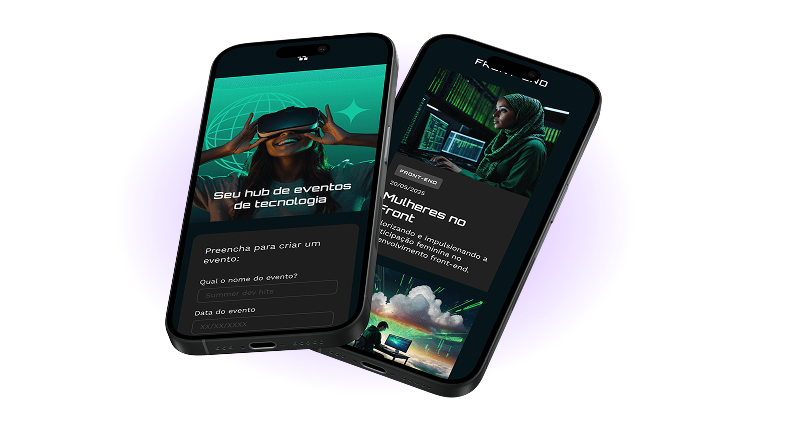

# Tecboard

Landing page responsiva do Tecboard App, uma plataforma de monitoramento de aplicacoes em tempo real. O projeto apresenta a proposta do produto, destaca os alertas inteligentes e direciona o visitante para a versao demo.

## Preview



## Sobre o projeto

O Tecboard foi desenvolvido como uma interface de apresentacao para um aplicativo de observabilidade. A pagina utiliza uma composicao visual com fundo escuro, tipografia personalizada, destaque roxo e mockups do aplicativo para comunicar a ideia de monitoramento continuo.

### Funcionalidades atuais

- Layout responsivo para desktop, tablet e celular.
- Secao principal com chamada para acao da versao demo.
- Tipografia local com as fontes Unbounded e Poppins.
- Imagens e logo do produto armazenadas no proprio repositorio.
- Efeito visual no botao de demonstracao ao passar o mouse.
- Metadados de descricao e compartilhamento configurados no HTML.

> Observacao: o link do botao **Testar versao demo** esta temporariamente configurado como `#` e deve ser substituido pela URL real da demonstracao quando ela estiver disponivel.

## Tecnologias

- HTML5
- CSS3
- CSS `@font-face` para carregamento das fontes locais
- GitHub Pages ou qualquer servidor de arquivos estaticos para publicacao

Nao ha framework JavaScript, dependencias externas ou processo de build neste projeto.

## Estrutura do projeto

```text
tecboard-main/
|- index.html                    # Pagina principal
|- css/
|  `- style.css                  # Estilos, fontes e media queries
|- fonts/
|  |- Poppins-Regular.ttf        # Fonte de apoio para textos
|  `- Unbounded-Bold.ttf         # Fonte dos titulos
`- img/
   |- celulares-sobrepostos-mobile.png
   |- celulares-sobrespostos-desktop.png
   `- logo-tecboard-branco.png
```

## Como executar localmente

Como o projeto e composto por arquivos estaticos, pode ser executado sem instalacao de pacotes.

### Opcao 1: abrir diretamente

1. Clone ou baixe este repositorio.
2. Abra o arquivo `index.html` em um navegador.

### Opcao 2: usar um servidor local

Com Python instalado, execute na raiz do projeto:

```bash
python -m http.server 8000
```

Depois, acesse [http://localhost:8000](http://localhost:8000) no navegador.

Tambem e possivel usar a extensao Live Server do VS Code para recarregar a pagina automaticamente durante o desenvolvimento.

## Responsividade

O layout possui ajustes para diferentes larguras de tela:

- Desktop: composicao centralizada com titulo de 64 px e imagem principal de 792 px.
- Ate 768 px: ajustes de posicionamento do logo e da largura do texto.
- Ate 375 px: tipografia, botao e mockup reduzidos para telas pequenas.

## Publicacao no GitHub Pages

1. Envie o projeto para um repositorio no GitHub.
2. No repositorio, abra **Settings > Pages**.
3. Em **Build and deployment**, selecione **Deploy from a branch**.
4. Escolha a branch principal e a pasta `/ (root)`.
5. Salve e aguarde a geracao da URL publica.

O arquivo `index.html` na raiz permite que o GitHub Pages reconheca a pagina inicial automaticamente.

## Melhorias futuras

- Conectar o botao de demo a uma aplicacao funcional.
- Adicionar uma pagina ou formulario de contato.
- Incluir estados e dados reais de monitoramento.
- Adicionar testes de acessibilidade e validacao automatizada do HTML.

## Licenca

Este projeto foi criado para fins educacionais e de estudo durante o curso de HTML e CSS da Alura. Consulte o autor do repositorio antes de reutilizar as imagens, fontes ou identidade visual em outros projetos.